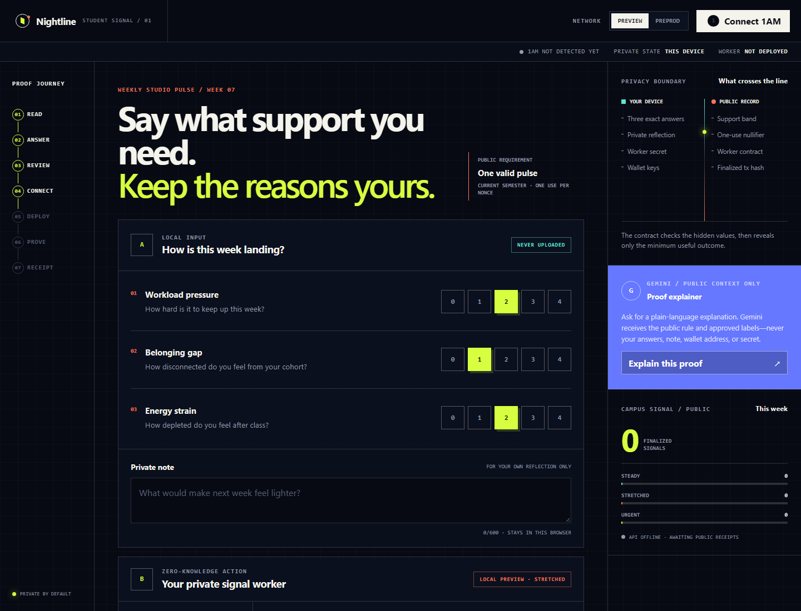
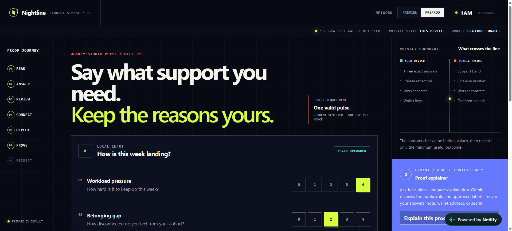
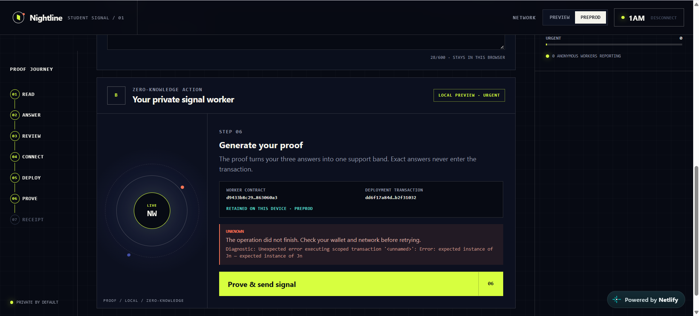
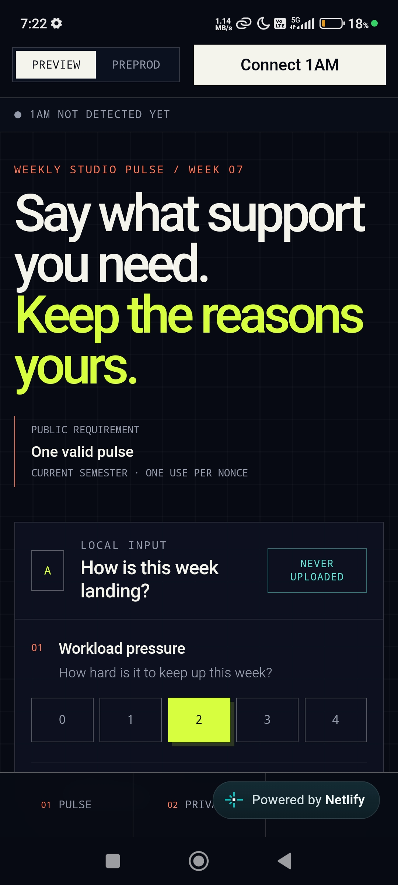
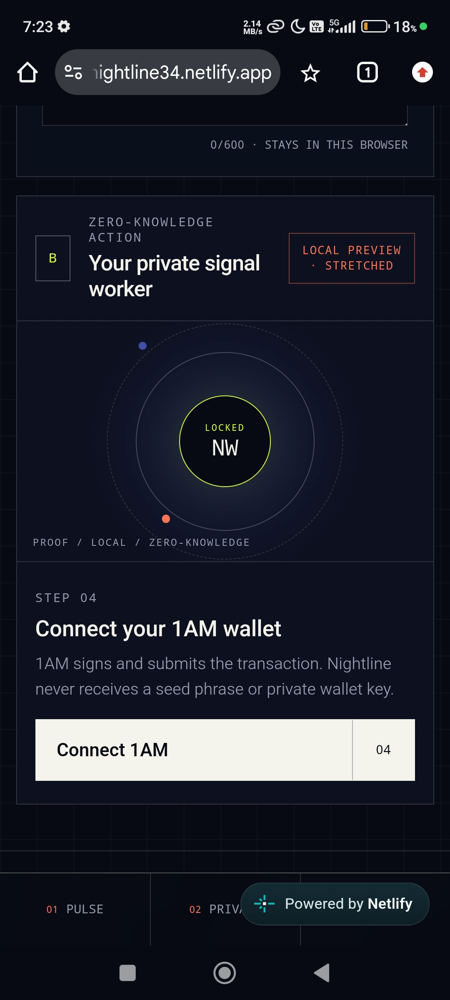
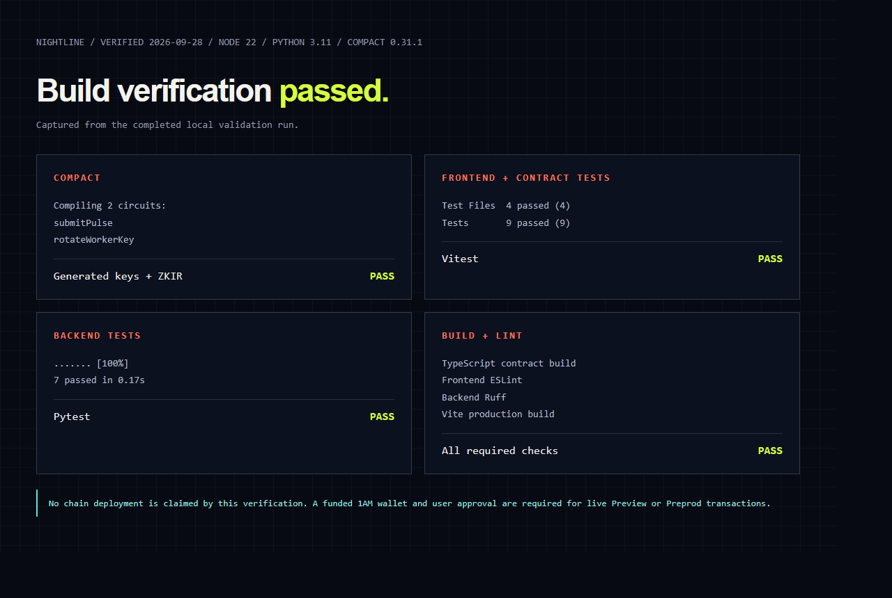

# Nightline

Nightline is a privacy-preserving weekly support pulse for students. The students answers three questions and can keep a private note on their own device. A Compact circuit turns those private values into one public support band, enforces one-use submission with a nullifier, and records a finalized proof on Midnight.

Each student connects 1AM and deploys their own Nightline worker contract from the browser. The frontend retains that worker’s real contract address and finalized deployment transaction hash per network. It never fabricates identifiers or treats an unfinalized transaction as complete.



## Why Midnight

Ordinary surveys ask students to trust a server with raw answers. Nightline uses a private witness for the exact 0–4 responses and a device-held worker secret. The chain verifies range, ownership, classification, and replay prevention while learning only the approved band and a one-use nullifier.

## Privacy model

| An observer can learn | An observer cannot learn |
| --- | --- |
| Selected network | Exact workload, belonging, or energy answers |
| Worker contract address | Private reflection text |
| Finalized deployment and pulse transaction hashes | Worker secret or next worker secret |
| Coarse band: steady, stretched, or urgent | Wallet seed, signing key, or private wallet data |
| One-use nullifier and public aggregate counts | Why a student received a particular band |

Gemini receives only public policy text and approved non-sensitive labels. The API redacts obvious emails, long account-like numbers, Midnight addresses, and seed-like phrases before the model call. It stores a SHA-256 hash of the public requirement and the validated structured plan, never the raw requirement.

## Components

- React, TypeScript, Vite, Framer Motion, and accessible responsive CSS.
- 1AM-first discovery through UUID-keyed `window.midnight` providers using DApp Connector API 4.x.
- Midnight.js 4.1.1 with Preview and Preprod switching, real browser deployment, wallet balancing/submission, indexer finalization, and committed Compact artifacts.
- Compact 0.31.1 contract with `submitPulse` and `rotateWorkerKey`, private witnesses, explicit disclosures, public counters, and nullifier replay prevention.
- FastAPI, Pydantic, SQLAlchemy async, Alembic, Neon-ready pooled/direct URLs, and SQLite development fallback.
- Current Google GenAI SDK with structured output and a deterministic privacy-safe fallback.
- Netlify frontend configuration and a Render blueprint for the API.

## Local setup

Prerequisites: Node.js 22+, Python 3.11+, the 1AM browser wallet, the Compact 0.31.1 toolchain, and Docker for a local proof server.

```text
npm install
npm run contract:compile
npm run dev
```

The frontend runs at `http://localhost:4173`. For local API work:

```text
cd backend
uv sync --extra dev --python 3.11
uv run alembic upgrade head
uv run uvicorn app.main:app --reload --port 8000
```

Start the Midnight proof server separately:

```text
docker run --rm -p 127.0.0.1:6300:6300 midnightntwrk/proof-server:8.1.0 midnight-proof-server -v
```

Copy `.env.example` to `.env` and set `VITE_API_URL`. `VITE_PROOF_SERVER_URL` is a local-development fallback; production uses the user-controlled proof server configured in 1AM because proving inputs include private witness data.

## 1AM workflow

1. Install, unlock, and fund 1AM on Preview or Preprod with enough DUST.
2. Choose the same network in Nightline and connect 1AM.
3. Deploy the personal worker. Wait for finality; Nightline then displays and retains the real address and deployment hash.
4. Review the disclosure boundary and submit the pulse.
5. Keep browser storage intact. The local secret has no server-side recovery path in this MVP.

Switching networks clears the active wallet session and loads only that network’s retained deployment. Disconnecting clears the in-memory connection but does not revoke the extension’s permission.

## Preprod

- **Status:** Successful deployment at block 2,776,359.
- **Contract address:** [`d9433b8c29d5ef4e85162eb19dabd02885ab3d4c96b61f2fa199965a863060a3`](https://explorer.1am.xyz/contract/d9433b8c29d5ef4e85162eb19dabd02885ab3d4c96b61f2fa199965a863060a3)
- **Deployment transaction hash:** [`dd6f17a84d15a8489abe4d5bfbe4a6632f25558cb9327638d18ef4d0b2f31032`](https://explorer.1am.xyz/tx/dd6f17a84d15a8489abe4d5bfbe4a6632f25558cb9327638d18ef4d0b2f31032?network=preprod)

## Live Website Screenshots

The Preprod app with 1AM connected and the student pulse form:



The retained worker address and deployment transaction, with the proof error visible during the subsequent step:



## Live Website URL

[https://nightline34.netlify.app/](https://nightline34.netlify.app/)

## Demo Video URL

[Watch the Nightline demo on Google Drive](https://drive.google.com/file/d/1DJO8OIRNh5sveu-BS6IJfeMcSXjz_sIa/view?usp=sharing)

## Mobile Responsive UI

Nightline's student pulse form at a phone-sized viewport:



The mobile worker panel and wallet connection step:



## Neon

Create production and development branches in Neon. Use the pooled URL as `DATABASE_URL` for API traffic and the direct URL as `DATABASE_DIRECT_URL` for Alembic. Run migrations against the development branch first:

```text
cd backend
DATABASE_DIRECT_URL="postgresql://..." uv run alembic upgrade head
```

The schema stores public authority metadata, contract addresses, finalized transaction hashes, signal bands, disclosure scope, aggregate counts, and hashed Gemini request metadata. Receipt validation rejects known private-field names before database access.

## Gemini

Set `GEMINI_API_KEY` only on Render. `POST /api/v1/plans` sends the redacted public requirement and approved labels to Gemini, validates structured JSON with Pydantic, and returns the local fallback if the key is absent or the model call fails.

## Verification

```text
npm run contract:compile
npm run contract:build
npm run lint
npm test
npm run build

cd backend
uv run pytest -q
uv run ruff check app tests alembic
```

Verified results for this build: Compact compiled two circuits, 9 frontend/contract tests passed, 7 backend tests passed, frontend and backend lint passed, the contract TypeScript build passed, and the production frontend build passed.



## CI/CD Pipeline

`.github/workflows/ci-cd.yml` runs frontend lint, tests, contract build, and production build plus backend tests and lint on pull requests and pushes to `main` or `master`. No GitHub secrets or deploy tokens are needed.

For CD, Netlify deploys from its normal Git connection. Render deploys after GitHub checks pass (`autoDeployTrigger: checksPass` in `render.yaml`). If Netlify is already connected to this repository, pushes continue to publish the site automatically.

## Deployment

For Netlify, connect this repository once if it is not already connected, and set `VITE_API_URL` in the Netlify site environment to the Render API URL. The committed `contract/src/managed/nightline` artifacts are copied into the final `/keys` and `/zkir` paths during each build.

For Render, apply `render.yaml` and connect it to this GitHub repository. Configure the Neon URLs, Gemini key, and the deployed Netlify origin. Keep proving on the user-controlled server configured in 1AM; do not route private witness material through the public API service.

## Project map

```text
contract/        Compact source, witnesses, and generated ZK artifacts
src/             React product, wallet bridge, storage, API client, and tests
backend/app/     FastAPI application and privacy services
backend/alembic/ Neon/Postgres migrations
backend/tests/   API, validation, aggregation, redaction, and fallback tests
docs/            Product, privacy, architecture, and demo material
```

## Known limits

- A funded wallet and reachable proof server are required for real deployment and proof generation.
- Device-local state has no recovery mechanism in this MVP.
- Public aggregates are useful for service planning and are not diagnoses or emergency triage.
- The API records finalized receipts submitted by the browser; production deployments should add independent indexer verification before institutional use.

Future work should add encrypted private-state export, issuer-signed enrollment proofs, indexer-side receipt verification, cohort threshold suppression, and a campus-owned emergency escalation policy that remains outside the anonymous pulse.
